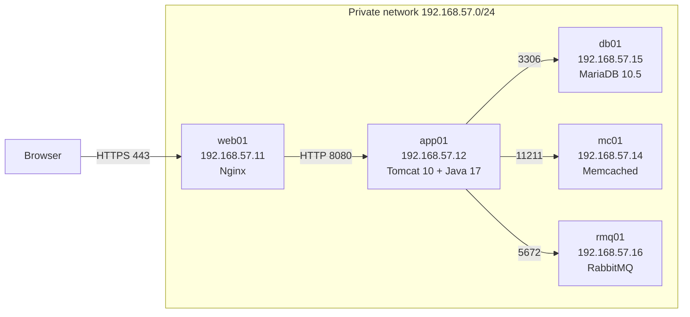

# infralab-localdevstack

> A 5-VM local Java application stack (Nginx → Tomcat → MariaDB + Memcached + RabbitMQ) fully automated with Vagrant. The architecture mirrors a production AWS deployment 1:1, with [`docs/aws-migration-plan.md`](docs/aws-migration-plan.md) documenting the service mapping and migration plan. This project targets Apple Silicon Macs (M1/M2/M3/M4) using VMware Fusion.

[](./LICENSE)
[](https://www.vagrantup.com/)
[](https://www.centos.org/)

## What's in here

A full lift-and-shift deployment of a 3-tier Java web application running across five virtual machines on your laptop. The application that runs on top of the infrastructure this project is building is the [VProfile](https://github.com/hkhcoder/vprofile-project) application. This application has been chosen because it exercises every layer a typical enterprise Java service depends on: a relational database, a caching layer, a message broker, an application container, and a reverse-proxy web server.

## Requirements    

- **Vagrant 2.4+** 
- VMware Fusion 13+ (Apple Silicon)
- **5 GB free RAM** for the VMs
- **`vagrant-hostmanager` plugin** (install with `vagrant plugin install vagrant-hostmanager`)
- **On VMware:** the `vagrant-vmware-desktop` plugin         

## Architecture



All five VMs sit on a private network. The host machine reaches the application via Nginx on `web01`. Firewalls (`firewalld`) on each backend VM allow traffic only from the application subnet, simulating AWS security groups.

### Service responsibilities

| VM      | IP              | OS                | Memory | Role                                              |
|---------|-----------------|-------------------|--------|---------------------------------------------------|
| `web01` | 192.168.56.21   | CentOS Stream 9   | 512 MB | Nginx reverse proxy, HTTPS termination            |
| `app01` | 192.168.56.22   | CentOS Stream 9   | 2 GB   | Tomcat 10 + Java 17, hosts the deployed WAR       |
| `mc01`  | 192.168.56.24   | CentOS Stream 9   | 512 MB | Memcached for session and query caching           |
| `db01`  | 192.168.56.25   | CentOS Stream 9   | 1 GB   | MariaDB 10.5 with the application schema          |
| `rmq01` | 192.168.56.23   | CentOS Stream 9   | 1 GB   | RabbitMQ message broker for async work            |

Total resource budget: 6.5 GB RAM, 5 CPU cores. 

## Quick start

```bash
# 1. Install the vagrant-hostmanager plugin (once per machine)
vagrant plugin install vagrant-hostmanager
vagrant plugin install vagrant-vmware-desktop

# 2. Bring up all 5 VMs in dependency order
vagrant up --no-parallel --provider=vmware_desktop

# 3. Verify the stack is healthy
make test

# 4. Open the application
open https://192.168.56.21/
```

Accept the self-signed certificate warning in your browser (the cert
simulates AWS ACM in production, see the migration plan for what changes).

## Application Credentials
Login to the web application at https://192.168.57.11/
- Username: admin_vp
- Password: admin_vp

## Service Credentials (for debugging/inspection)
If you SSH into backend VMs for troubleshooting:

### Database (db01)
- Root: mysql -u root -padmin123
- App user: mysql -u admin -padmin123 -h db01 accounts

### RabbitMQ (rmq01)
- User: test
- Password: test
- Management UI: http://192.168.57.16:15672 (test / test)

### Memcached (mc01)
- No authentication required
- Telnet to 192.168.57.14:11211

## How the VMs find each other

The application reads backend hostnames from `application.properties`:

```properties
jdbc.url=jdbc:mysql://db01:3306/accounts
memcached.active.host=mc01
rabbitmq.address=rmq01
```
These hostnames resolve because the [`vagrant-hostmanager`](https://github.com/devopsgroup-io/vagrant-hostmanager) plugin writes `/etc/hosts` entries on every VM as they boot. From `app01`, `ping db01` works because hostmanager added `192.168.57.15 db01` to its `/etc/hosts`.

In production AWS, this is replaced by **Route 53 private hosted zones**, same UX (`db01.vprofile.internal`), different mechanism. See the [migration plan](docs/aws-migration-plan.md) for details.

## Security model

| Source           | Destination       | Port  | Why                                |
|------------------|-------------------|-------|------------------------------------|
| Host             | web01             | 80    | Redirects to HTTPS                 |
| web01            | app01             | 8080  | Reverse-proxy backend              |
| app01            | db01              | 3306  | MariaDB                            |
| app01            | mc01              | 11211 | Memcached                          |
| app01            | rmq01             | 5672  | RabbitMQ                           |
| everyone else    | anything backend  | -     | denied by firewalld                |

## AWS migration

| Local component        | AWS production equivalent                |
|------------------------|------------------------------------------|
| Nginx on `web01`       | Application Load Balancer + ACM cert     |
| Tomcat on `app01`      | EC2 Auto Scaling Group behind the ALB    |
| MariaDB on `db01`      | RDS MySQL Multi-AZ                       |
| Memcached on `mc01`    | ElastiCache (Memcached engine)           |
| RabbitMQ on `rmq01`    | Amazon MQ (RabbitMQ engine)              |
| `/etc/hosts` via plugin | Route 53 Private Hosted Zone            |
| `firewalld` zones      | VPC Security Groups                      |

The full migration plan, with cost estimate and Terraform pseudocode, is in [`docs/aws-migration-plan.md`](docs/aws-migration-plan.md). GCP service mapping is in [`docs/gcp-equivalence.md`](docs/gcp-equivalence.md).

## Testing

After the set up completes, `make test` runs a layered check:

1. **L1 — Network:** every VM responds to ping
2. **L2 — Ports:** every service is listening on its expected port
3. **L3 — Application:** Nginx serves HTTPS, the app returns a login page

Output looks like:

```
infralab test
===================

L1: Network reachability
  db01 (192.168.57.15) responds to ping              OK
  mc01 (192.168.57.14) responds to ping              OK
  ...

L3: Application response
  Nginx redirects HTTP to HTTPS                      OK
  App returns login page over HTTPS                  OK

===================
All 13 checks passed.
```

## What I learned building this

- **`vagrant up --no-parallel` is non-negotiable for ordered stacks.**
  Tomcat's provisioning depends on db01/mc01/rmq01 being reachable at boot,
  so they have to come up first. Default parallel mode breaks this.
- **`vagrant-hostmanager` is the right abstraction for local Route 53.**
  Hardcoding IPs in `application.properties` would couple the app to the
  exact subnet. Using hostnames is portable and matches what real AWS DNS
  looks like.
- **`firewalld` zones model AWS Security Groups well.** Both are
  source-IP-and-port allow-lists, both default-deny. Practicing one teaches
  the mental model for the other.
- **Self-signed certs are a feature, not a hack.** They prove the
  HTTPS-termination layer works without paying for a real cert. AWS ACM
  replaces the cert at deployment time with a single Terraform variable.
- **CentOS Stream 9 vs Ubuntu: pick one and stick with it.** A mixed-OS
  fleet looks unintentional in a portfolio. RHEL-family knowledge (dnf,
  firewalld, SELinux) is worth signaling separately from Ubuntu/apt.

## Requirements

- **Vagrant 2.4+**
- **One hypervisor:**
  - VirtualBox 7+ (Linux / Windows / Intel Mac)
  - VMware Fusion 13+ (Apple Silicon)
- **5 GB free RAM** for the VMs
- **`vagrant-hostmanager` plugin** (install with `vagrant plugin install vagrant-hostmanager`)
- **On VMware:** the `vagrant-vmware-desktop` plugin

## Project Layout

```
infralab-localdevstack/
?~T~\?~T~@?~T~@ Vagrantfile                  # 5-VM definition, dual-provider
?~T~\?~T~@?~T~@ Makefile                     # make up, make test, ...
?~T~\?~T~@?~T~@ db_backup.sql                # seed schema + data for MariaDB
?~T~\?~T~@?~T~@ provisioning/
?~T~B   ?~T~\?~T~@?~T~@ mysql.sh                 # db01: MariaDB + vprofile seed import
?~T~B   ?~T~\?~T~@?~T~@ memcache.sh              # mc01: Memcached
?~T~B   ?~T~\?~T~@?~T~@ rabbitmq.sh              # rmq01: Erlang + RabbitMQ + user
?~T~B   ?~T~\?~T~@?~T~@ tomcat.sh                # app01: Java 17 + Maven build + Tomcat 10
?~T~B   ?~T~T?~T~@?~T~@ nginx.sh                 # web01: Nginx reverse proxy + self-signed cert
?~T~\?~T~@?~T~@ scripts/
?~T~B   ?~T~T?~T~@?~T~@ test.sh             # end-to-end health check (network + ports + HTTP)
?~T~T?~T~@?~T~@ docs/
    ?~T~\?~T~@?~T~@ setup.md                 # per-OS install guide
    ?~T~\?~T~@?~T~@ architecture.md          # detailed component walkthrough
    ?~T~\?~T~@?~T~@ network-topology.md      # IP plan, hostname resolution, port matrix
    ?~T~\?~T~@?~T~@ aws-migration-plan.md    # service mapping, costs, Terraform sketch
    ?~T~T?~T~@?~T~@ gcp-equivalence.md       # same mapping for Google Cloud
```

## License

MIT — see [LICENSE](./LICENSE).
